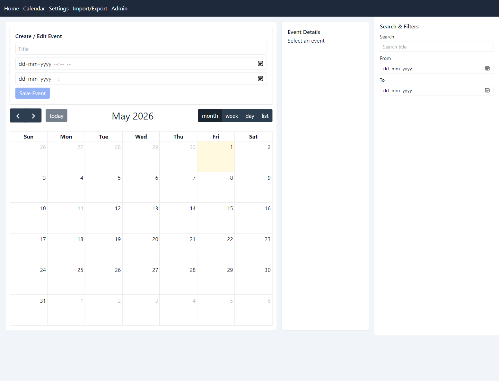
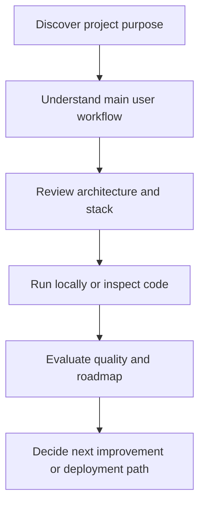
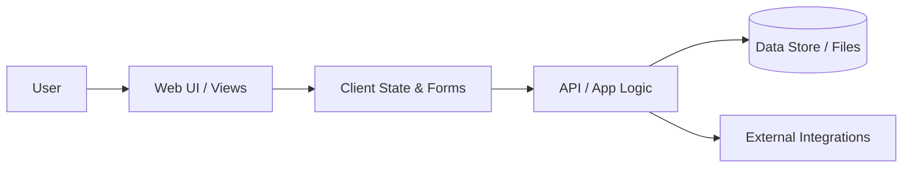
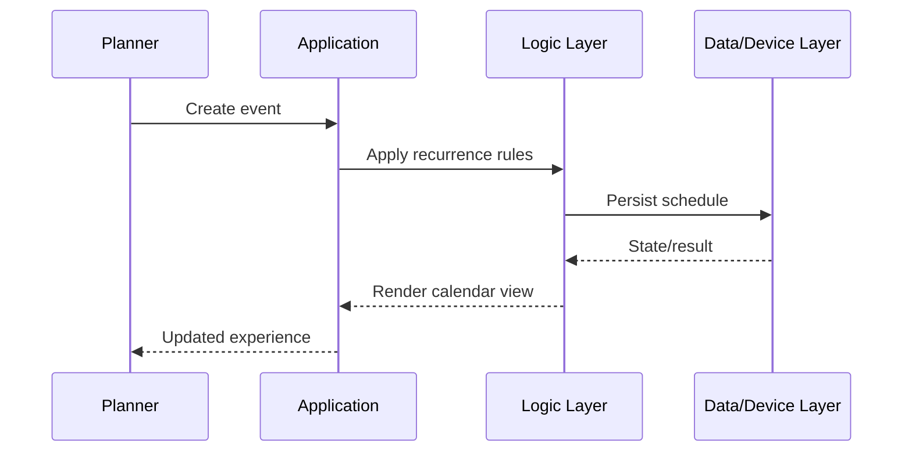

<div align="center">

# Planora

### Full-stack calendar and admin platform with recurrence, ICS import/export, and PostgreSQL-backed event workflows.


**Repository:** [bhedanikhilkumar-code/Planora](https://github.com/bhedanikhilkumar-code/Planora)

<!-- REPO_HEALTH_BADGE_START -->
[](https://github.com/bhedanikhilkumar-code/Planora/actions/workflows/repository-health.yml)
<!-- REPO_HEALTH_BADGE_END -->

</div>

---

## Executive Overview

Planora is a full-stack calendar and admin platform for event planning, recurrence handling, ICS import/export, user authentication, attachments, audit logs, and admin management.

The project is positioned as a **portfolio-grade scheduling product**: it combines a React calendar UI, Express/Prisma backend, PostgreSQL persistence, recurrence logic, import/export flows, and admin screens that show product thinking beyond a simple calendar clone.

## Recruiter Quick Scan

| What to notice | Why it matters |
| --- | --- |
| **Real scheduling domain** | Events, recurrence, reminders, attachments, ICS import/export, filtering, and date-range workflows. |
| **Full-stack architecture** | Monorepo with separate frontend/backend apps, Prisma data access, PostgreSQL-ready design, and typed TypeScript boundaries. |
| **Admin tooling** | Admin dashboard, users, event management, settings, audit logs, and protected admin routes. |
| **Quality mindset** | Backend Jest/Supertest setup, frontend Vitest setup, validation with Zod, auth middleware, rate limiting, and security headers. |
| **Recruiter signal** | Demonstrates practical product engineering around time, data, roles, validation, and interoperability. |

## Demo Preview

| Calendar workspace |
| --- |
|  |

> Screenshot captured from the local running frontend so visitors can see the calendar experience without installing the project first.

## Product Positioning

| Question | Answer |
| --- | --- |
| **Who is it for?** | Individuals, teams, admins, and reviewers who need structured scheduling, import/export, and calendar management workflows. |
| **What problem does it solve?** | Calendar tools often become hard to inspect, migrate, or manage at scale. Planora centralizes scheduling with recurrence, filtering, ICS interoperability, and admin oversight. |
| **Why it matters?** | It demonstrates full-stack planning around dates, roles, security, validation, persistence, and operational admin workflows. |
| **Current focus** | More polished frontend states, timezone edge-case testing, richer import/export flows, and production deployment readiness. |

## Repository Snapshot

| Area | Details |
| --- | --- |
| Visibility | Public portfolio repository |
| Primary stack | `React`, `TypeScript`, `Express`, `Prisma`, `PostgreSQL`, `FullCalendar` |
| Product areas | Calendar views, recurrence, reminders, attachments, import/export, auth, admin dashboard, audit logs |
| Useful commands | `npm run dev`, `npm run build`, `npm run test`, `npm run prisma:migrate -w @planora/backend` |
| Key dependencies | `@fullcalendar/*`, `@prisma/client`, `express`, `ics`, `ical.js`, `rrule`, `zod`, `jest`, `vitest` |

## Topics

`calendar` · `express` · `postgresql` · `prisma` · `react` · `typescript`

## Key Capabilities

| Capability | Description |
| --- | --- |
| **Calendar workspace** | Month/week/day/list calendar views with event creation, filtering, and drawer-based event review. |
| **Recurring events** | Recurrence service and API endpoints for recurring schedules and occurrence expansion. |
| **ICS interoperability** | Import `.ics` files, validate calendar payloads, and export event ranges as calendar files. |
| **User workflows** | Auth pages, protected calendar routes, settings, search filters, reminders, and attachment-aware event APIs. |
| **Admin operations** | Admin login, dashboard, user detail pages, event management, settings, and audit log review. |
| **Backend discipline** | Prisma persistence, Zod validation, auth middleware, rate limiting, error handling, storage adapter, and test setup. |

<!-- PROJECT_DOCS_HUB_START -->

## Documentation Hub

| Document | Purpose |
| --- | --- |
| [Architecture](docs/ARCHITECTURE.md) | System layers, workflow, data/state model, and extension points. |
| [Case Study](docs/CASE_STUDY.md) | Product framing, decisions, tradeoffs, and portfolio story. |
| [Roadmap](docs/ROADMAP.md) | Practical next steps for turning the project into a stronger product. |
| [Quality Standard](docs/QUALITY.md) | Repository health checks, review standards, and quality gates. |
| [Review Checklist](docs/REVIEW_CHECKLIST.md) | Final share/recruiter review checklist for a stronger GitHub impression. |
| [Contributing](CONTRIBUTING.md) | Branching, commit, review, and quality guidelines. |
| [Security](SECURITY.md) | Responsible disclosure and safe configuration notes. |
| [Support](SUPPORT.md) | How to ask for help or report issues clearly. |
| [Code of Conduct](CODE_OF_CONDUCT.md) | Collaboration expectations for respectful project activity. |

<!-- PROJECT_DOCS_HUB_END -->

## Detailed Product Blueprint

### Experience Map



### Feature Depth Matrix

| Layer | What reviewers should look for | Why it matters |
| --- | --- | --- |
| Product | Clear user problem, target audience, and workflow | Shows product thinking beyond tutorial-level code |
| Interface | Screens, pages, commands, or hardware interaction points | Demonstrates how users actually experience the project |
| Logic | Validation, state transitions, service methods, processing flow | Proves the project can handle real use cases |
| Data | Local storage, database, files, APIs, or device input/output | Explains how information moves through the system |
| Quality | Tests, linting, setup clarity, and roadmap | Makes the project easier to trust, extend, and review |

### Conceptual Data / State Model

| Entity / State | Purpose | Example fields or responsibilities |
| --- | --- | --- |
| User input | Starts the main workflow | Form values, commands, uploaded files, device readings |
| Domain model | Represents the project-specific object | Transaction, note, shipment, event, avatar, prediction, song, or task |
| Service layer | Applies rules and coordinates actions | Validation, scoring, formatting, persistence, API calls |
| Storage/output | Keeps or presents the result | Database row, local cache, generated file, chart, dashboard, or device action |
| Feedback loop | Helps improve the next interaction | Status message, analytics, error handling, recommendations, roadmap item |

### Professional Differentiators

- **Documentation-first presentation:** A reviewer can understand the project without guessing the intent.
- **Diagram-backed explanation:** Architecture and workflow diagrams make the system easier to evaluate quickly.
- **Real-world framing:** The README describes users, outcomes, and operational flow rather than only listing files.
- **Extension-ready roadmap:** Future improvements are scoped so the project can keep growing cleanly.
- **Portfolio alignment:** The project is positioned as part of a consistent, professional GitHub portfolio.

## Architecture Overview



## Core Workflow



## How the Project is Organized

```text
Planora/
├── 📁 apps
│   ├── 📁 backend
│   └── 📁 frontend
├── 📄 docker-compose.yml
├── 📄 package-lock.json
├── 📄 package.json
```

## Engineering Notes

- **Separation of concerns:** UI, business logic, data/services, and platform concerns are documented as separate layers.
- **Scalability mindset:** The project structure is ready for new screens, services, tests, and deployment improvements.
- **Portfolio quality:** README content is designed to communicate value before someone even opens the code.
- **Maintainability:** Naming, setup steps, and roadmap items make future work easier to plan and review.
- **User-first framing:** Features are described by the value they provide, not just the technology used.

## Local Setup

```bash
# 1. Install dependencies
npm install

# 2. Start development server
npm run dev

# 3. Build or validate production output
npm run build
```

## Suggested Quality Checks

Before shipping or presenting this project, run the checks that match the stack:

| Check | Purpose |
| --- | --- |
| Format/lint | Keep code style consistent and reviewer-friendly. |
| Static analysis | Catch type, syntax, and framework-level issues early. |
| Unit/widget tests | Validate important logic and user-facing workflows. |
| Manual smoke test | Confirm the main flow works from start to finish. |
| README review | Ensure documentation matches the actual repository state. |

## Roadmap

- Calendar sharing workflows
- ICS improvements
- Timezone edge-case testing
- Recurring event analytics

## Professional Review Checklist

- [x] Clear project purpose and audience
- [x] Feature list aligned with real user workflows
- [x] Architecture documented with diagrams
- [x] Screenshots added for quick recruiter review
- [ ] Setup steps tested on a clean machine
- [ ] Environment variables documented without exposing secrets
- [ ] Tests/lint commands documented
- [ ] Roadmap shows practical next steps

## Screenshots / Demo Notes

| Asset | Status |
| --- | --- |
| Calendar workspace preview | Added at `docs/assets/screenshots/planora-calendar.png` |
| Workflow GIF | Future improvement: create event → apply recurrence → export ICS walkthrough |
| Architecture image | Future improvement: exported visual version of the Mermaid architecture diagram |

## Contribution Notes

This project can be extended through focused, well-scoped improvements:

1. Pick one feature or documentation improvement.
2. Create a small branch with a clear name.
3. Keep changes easy to review.
4. Update this README if setup, features, or architecture changes.
5. Open a pull request with screenshots or test notes when possible.

## License

Add or update the license file based on how you want others to use this project. If this is a portfolio-only project, document that clearly before accepting external contributions.

---

<div align="center">

**Built and documented with a focus on professional presentation, practical workflows, and clean engineering communication.**

</div>
